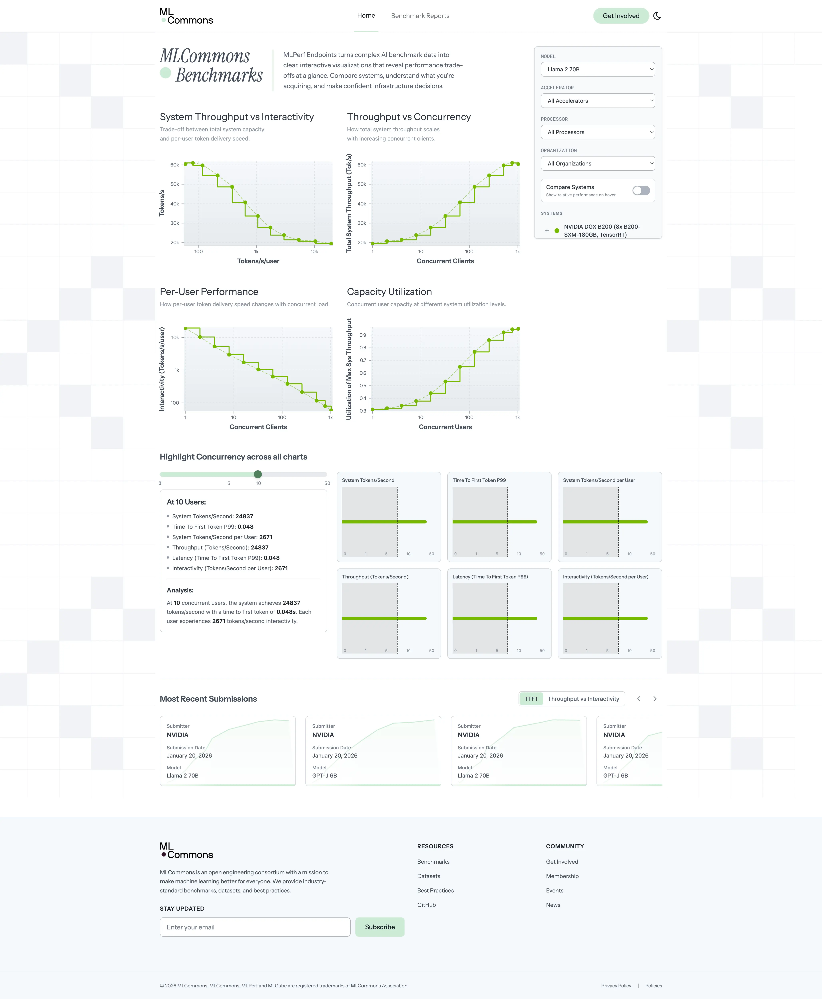

# ML Endpoints



This is a SvelteKit application for the [MLCommons Endpoints](https://mlendpoints.bulletpages.com) project that parses benchmark API data and displays it as a dashboard of charts and tables. The stack consists of:

* [SvelteKit](https://kit.svelte.dev/)
* [Tailwind CSS](https://tailwindcss.com/)
* [D3.js](https://d3js.org/)

## Getting Started

```sh
# Copy env variables from example
cp .env.example .env

# Install dependencies and run the dev server
bun install
bun run dev

# Build the production files
bun run build

# Serve out the production files
bun run build/index.js
```

the `build` command will create a `build` directory with production-ready files that we then serve out via the [`svelte-adapter-bun`](https://github.com/gornostay25/svelte-adapter-bun) adapter. A Caddyfile is also provided to then serve out the project via a reverse proxy.
